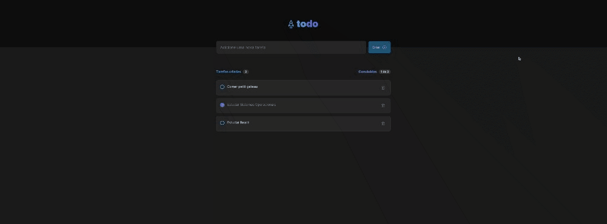

<div align="center" id="top"> 
  

  <!-- <a href="https://todolist.netlify.app">Demo</a> -->
</div>

<h1 align="center">ToDo List</h1>

<!-- <p align="center">
  <!-- 

  <!-- 

  

  <!--  

  <!--  

  <!--  

  <!--  
</p> -->

<!-- Status -->

<!-- <h4 align="center"> 
	🚧  Todo List 🚀 Under construction...  🚧
</h4> 

<hr> -->

<p align="center">
  <a href="#dart-about">About</a> &#xa0; | &#xa0; 
  <a href="#sparkles-features">Features</a> &#xa0; | &#xa0;
  <a href="#rocket-technologies">Technologies</a> &#xa0; | &#xa0;
  <a href="#white_check_mark-requirements">Requirements</a> &#xa0; | &#xa0;
  <a href="#checkered_flag-starting">Starting</a> &#xa0; | &#xa0;
  <!-- <a href="#memo-license">License</a> &#xa0; | &#xa0; -->
  <a href="https://github.com/oliveiralecca" target="_blank">Author</a>
</p>

<br>



## :dart: About ##

This project was developed as part of Ignite specialization. It's a ToDo list where it's possible to control your tasks to do or done.

## :sparkles: Features ##

:heavy_check_mark: Task adding;\
:heavy_check_mark: Task exclusion;\
:heavy_check_mark: Check and uncheck tasks;\
:heavy_check_mark: Tasks counter;\
:heavy_check_mark: Completed tasks counter;\
:heavy_check_mark: Empty state when having no tasks registered

## :rocket: Technologies ##

The following tools were used in this project:

- [Vite](https://vitejs.dev/)
- [React](https://pt-br.reactjs.org/)
- [TypeScript](https://www.typescriptlang.org/)

## :white_check_mark: Requirements ##

Before starting :checkered_flag:, you need to have [Git](https://git-scm.com) and [Node](https://nodejs.org/en/) installed.

## :checkered_flag: Starting ##

```bash
# Clone this project
$ git clone https://github.com/oliveiralecca/rocketseat-ignite-reactjs-challenges.git

# Access
$ cd rocketseat-ignite-reactjs-challenges
$ cd todo-list

# Install dependencies
$ yarn or npm i

# Run the project
$ yarn dev or npm run dev

# The project will initialize in the <http://localhost:5173>
```

<!-- ## :memo: License ##

This project is under license from MIT. For more details, see the [LICENSE](LICENSE.md) file. -->

&#xa0;

Made with 💕 by <a href="https://github.com/oliveiralecca" target="_blank">Letícia Oliveira</a>

&#xa0;

<a href="#top">Back to top 🔝</a>
